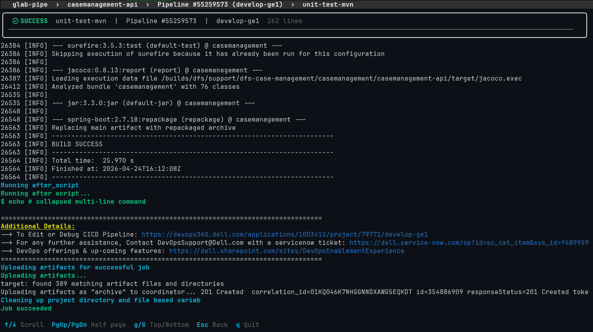

# glab-pipe — GitLab Pipeline Viewer

Interactive TUI (Terminal User Interface) for viewing and monitoring GitLab CI/CD pipelines on Dell GitLab (`gitlab.example.com`).

---

## Preview

> _Add example screenshots of the TUI screens here_

### Welcome Screen — Project Selector
<!--  -->

### Pipeline Table
<!--  -->

### Job List
<!--  -->

### Job Log Modal
<!--  -->

---

## Features

- **Welcome screen** with ASCII art and modal project selector
- **Pipeline table** with columns: Status, ID, Branch, Started At
- **Nerd Font icons** color-coded by status on all screens
- **Auto-refresh** every 2 seconds when pipelines or jobs are running
- **Job screen** with full job list per pipeline, plus a pipeline summary header
- **Log modal** (near full-screen) powered by `glab ci trace`, auto-updated while the job is running
- **Full Esc navigation** at every level
- **CLI arguments** for opening a project directly
- **External project config file** at `~/.glab-pipe/projects.json`
- **TUI installer** with dependency checks (glab, Nerd Font, PowerShell)

---

## Requirements

- **Go 1.22+** (for building only)
- **`glab` CLI** installed and authenticated with `gitlab.example.com`
- **Nerd Font** in your terminal (for correct icons — e.g. JetBrainsMono Nerd Font)
- **PowerShell** (recommended for best color support)

### Install glab
```powershell
scoop install glab
# or
winget install glab

# Authenticate with Dell GitLab
glab auth login --hostname gitlab.example.com
```

### Install a Nerd Font
Download and install a Nerd Font:
- [JetBrainsMono Nerd Font](https://github.com/ryanoasis/nerd-fonts/releases)
- [FiraCode Nerd Font](https://github.com/ryanoasis/nerd-fonts/releases)
- [CascadiaCode Nerd Font](https://github.com/ryanoasis/nerd-fonts/releases)

Then configure your terminal (Windows Terminal, PowerShell) to use the installed font.

---

## Installation

### Using the TUI Installer (recommended)

1. Build the project:
   ```batch
   build.bat
   ```

2. Run the installer:
   ```powershell
   dist\installer.exe
   ```
   The installer will:
   - Check that `glab` is installed and configured
   - Warn if a Nerd Font is not detected
   - Warn if PowerShell is not being used
   - Copy the binary to `%LOCALAPPDATA%\glab-pipe\glab-pipe.exe`
   - Add the directory to the user PATH (registry) and PowerShell profile
   - Create a `glab-pipe` function in the PowerShell profile

3. Restart PowerShell and run:
   ```powershell
   glab-pipe
   ```

### Manual Installation

1. Build:
   ```batch
   go build -ldflags="-s -w" -o dist\glab-pipe.exe .
   ```

2. Copy the binary to a directory in your PATH:
   ```powershell
   Copy-Item dist\glab-pipe.exe "$env:LOCALAPPDATA\glab-pipe\glab-pipe.exe"
   $env:PATH += ";$env:LOCALAPPDATA\glab-pipe"
   ```

3. Run:
   ```powershell
   glab-pipe
   ```

---

## Usage

### Commands

| Command | Description |
|---------|-------------|
| `glab-pipe` | Opens the main menu with project selector |
| `glab-pipe .` | Detects the GitLab project in the current directory and opens its pipelines |
| `glab-pipe --source <path>` | Opens pipelines for the given GitLab path |

**Examples:**
```powershell
# Main menu
glab-pipe

# Pipelines for the project in the current directory
cd C:\repos\case-gateway
glab-pipe .

# Pipelines by GitLab path
glab-pipe --source dfs/support/dfs-case-management/casemanagement/case-gateway
```

### Keyboard Shortcuts

#### Welcome Screen / Project Selector
| Key | Action |
|-----|--------|
| `↑` / `↓` or `k` / `j` | Navigate the list |
| `Enter` | Select project |
| `Esc` / `q` | Quit |

#### Pipeline Table
| Key | Action |
|-----|--------|
| `↑` / `↓` or `k` / `j` | Navigate pipelines |
| `Enter` | Open pipeline jobs |
| `r` | Manual refresh |
| `Esc` | Back to main menu |
| `q` | Quit |

#### Job List
| Key | Action |
|-----|--------|
| `↑` / `↓` or `k` / `j` | Navigate jobs |
| `Enter` | Open job logs |
| `r` | Manual refresh |
| `Esc` | Back to pipeline table |
| `q` | Quit |

#### Job Log Modal
| Key | Action |
|-----|--------|
| `Esc` | Close modal (returns to job list) |
| `q` | Quit |

---

## Navigation Flow

```
Welcome Screen (splash + project selector)
    │
    │ Enter (select project)
    ▼
Pipeline Table  ◄─────── Esc (back)
    │
    │ Enter (select pipeline)
    ▼
Job List ───────────────── Esc (back to pipeline table)
    │
    │ Enter (select job)
    ▼
Job Log Modal ──────────── Esc (close modal)
```

---

## Status Icons

| Icon | Color | Status |
|------|-------|--------|
| `` (\uf192) | Blue | Running |
| `` (\uf05d) | Green | Success |
| `` (\uf52f) | Red | Failed |
| `` (\ueabd) | Gray | Canceled |
| `` (\uf2be) | Yellow | Manual trigger |
| `` (\uf01d) | Yellow | Waiting for manual play |

> **Note:** Icons require a Nerd Font installed in your terminal.

---

## Auto-Refresh

The app auto-refreshes every **2 seconds** under the following conditions:

- **Pipeline table:** when any pipeline has status `running` or `pending`
- **Job list:** when the pipeline or any of its jobs is still running
- **Log modal:** when the selected job is still running

Auto-refresh stops automatically when no active processes remain.

---

## Project Configuration

Projects are loaded from `%USERPROFILE%\.glab-pipe\projects.json`.

The file is created automatically on first run with the default projects:

```json
{
  "projects": [
    {
      "display_name": "account-processor-api",
      "full_path": "dfs/support/dfs-case-management/casemanagement/account-processor-api"
    },
    {
      "display_name": "case-connector-api",
      "full_path": "dfs/support/dfs-case-management/casemanagement/case-connector-api"
    },
    {
      "display_name": "case-gateway",
      "full_path": "dfs/support/dfs-case-management/casemanagement/case-gateway"
    },
    {
      "display_name": "case-receiver-api",
      "full_path": "dfs/support/dfs-case-management/casemanagement/case-receiver-api"
    }
  ]
}
```

To add more projects, simply edit this JSON file.

---

## Building

```batch
# Build both binaries
build.bat

# Manually:
go build -ldflags="-s -w" -o dist\glab-pipe.exe .
go build -ldflags="-s -w" -o dist\installer.exe .\cmd\installer
```

### Manual debugging

```powershell
# Run directly without installing
dist\glab-pipe.exe

# Open current directory's project
dist\glab-pipe.exe .

# Open project by GitLab path
dist\glab-pipe.exe --source dfs/support/dfs-case-management/casemanagement/case-gateway
```

---

## Project Structure

```
gitlab-pipelines/
├── main.go                    # Entry point + CLI argument parsing
├── build.bat                  # Build script
├── go.mod / go.sum
├── cmd/
│   └── installer/
│       └── main.go            # TUI installer
├── internal/
│   ├── config/
│   │   └── config.go          # Read/write ~/.glab-pipe/projects.json
│   ├── gitlab/
│   │   └── gitlab.go          # glab CLI wrapper (ci list, ci get, ci trace)
│   ├── app/
│   │   └── app.go             # Main BubbleTea model + business logic
│   └── ui/
│       ├── ui.go              # All screen renderers
│       └── splash.go          # Welcome screen / project selector
├── dist/
│   ├── glab-pipe.exe          # Main application binary
│   └── installer.exe          # TUI installer binary
└── Documents/
    └── Usage.md               # Requirements specification
```

---

## Uninstalling

```powershell
# 1. Remove alias from PowerShell profile
notepad $PROFILE
# Delete the lines containing "glab-pipe"

# 2. Remove the install directory
Remove-Item -Recurse -Force "$env:LOCALAPPDATA\glab-pipe"

# 3. Remove the config file (optional)
Remove-Item -Recurse -Force "$env:USERPROFILE\.glab-pipe"
```

---

## License

MIT
